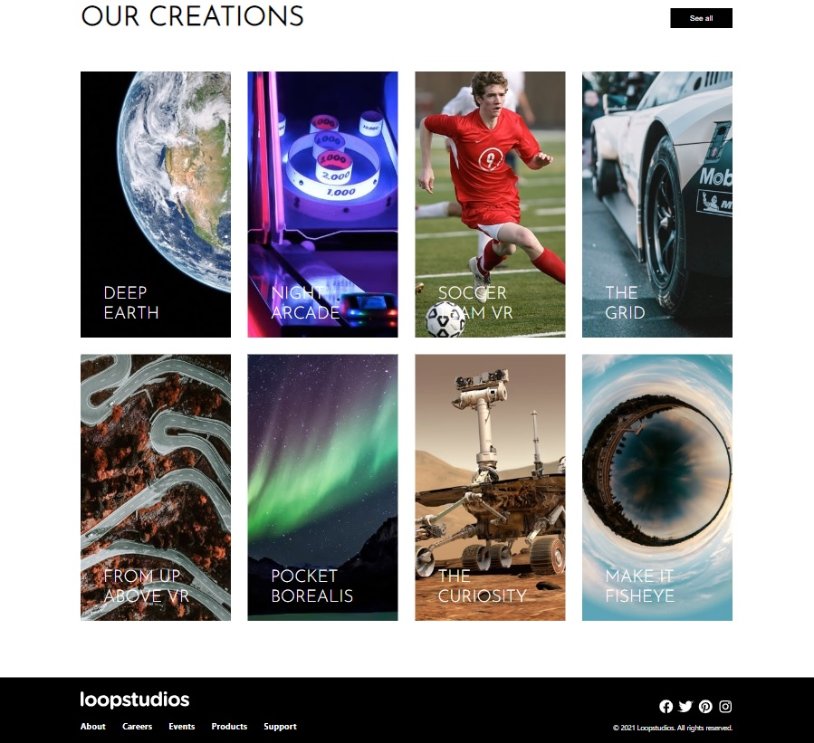

# Frontend Mentor - Testimonials grid section solution

This is a solution to the [Loopstudios landing page challenge on Frontend Mentor](https://www.frontendmentor.io/challenges/loopstudios-landing-page-N88J5Onjw). Frontend Mentor challenges help you improve your coding skills by building realistic projects.

## Table of contents

- [Overview](#overview)
- [The challenge](#the-challenge)
- [Screenshot](#screenshot)
- [Links](#links)
- [Author](#author)

## Overview

### The challenge

Users should be able to:

- View the optimal layout for the site depending on their device's screen size
- See hover states for all interactive elements on the page

### Screenshot

 

### Links

- Solution URL: https://github.com/dev-andrewm/loopstudios
- Live Site URL: https://github.com/dev-andrewm/loopstudios

## My process

### Built with

- React
- JavaScript
- Semantic HTML5 markup
- Grid-layout

## Author

- Frontend Mentor - [@dev-andrewm](https://www.frontendmentor.io/profile/dev-andrewm)
- LinkedIn - [@meyer-andre](https://www.linkedin.com/in/meyer-andre)
